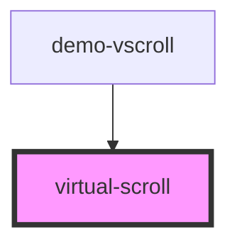

# virtual-scroll

<!-- Auto Generated Below -->

## Properties

| Property                | Attribute      | Description | Type        | Default     |
| ----------------------- | -------------- | ----------- | ----------- | ----------- |
| `height`                | `height`       |             | `number`    | `0`         |
| `onScrollReachedBottom` | --             |             | `() => any` | `undefined` |
| `renderAhead`           | `render-ahead` |             | `number`    | `1`         |
| `rowCount`              | `row-count`    |             | `number`    | `0`         |
| `rowHeight`             | `row-height`   |             | `number`    | `0`         |
| `rowRenderer`           | `row-renderer` |             | `any`       | `undefined` |
| `target`                | `target`       |             | `string`    | `"default"` |
| `type`                  | `type`         |             | `string`    | `"div"`     |

## Dependencies

### Used by

 - [demo-vscroll](../demo-vscroll)

### Graph

----------------------------------------------

*Built with [StencilJS](https://stenciljs.com/)*
